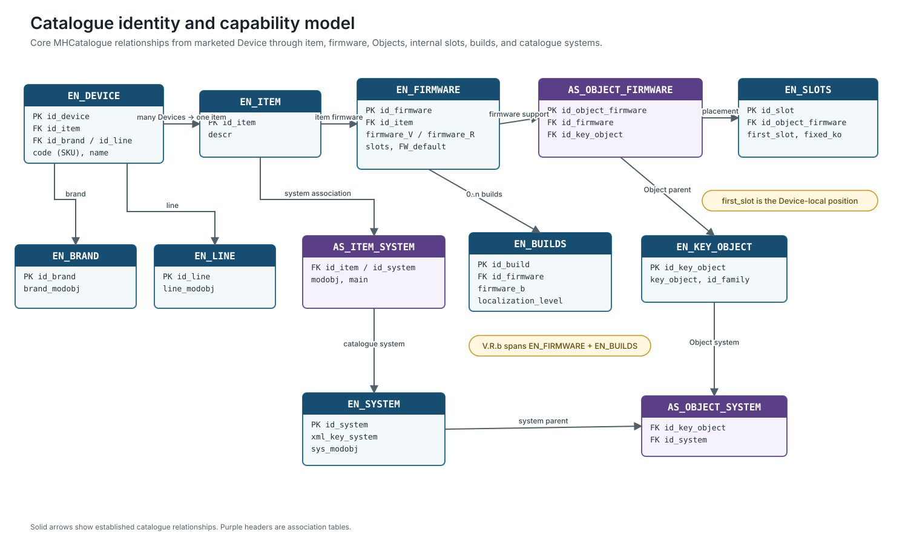

# Catalogue Resolution

`MHCatalogue.db` is the principal product-capability model. It connects marketed Devices and SKUs to shared items, firmware definitions, Modules, Objects, Virgin Objects, configuration definitions, and contextual constraints.

## Principal capability path

| Stage | Principal structure | Result |
| --- | --- | --- |
| Product | `EN_DEVICE` | branded Device record, standard name, and product code/SKU |
| Shared capability | `EN_ITEM` | item shared by one or more Device records |
| System identity | `AS_ITEM_SYSTEM` | catalogue system association and item-level `modobj` |
| Firmware | `EN_FIRMWARE`, `EN_BUILDS` | versioned capability definition |
| Object support | `AS_OBJECT_FIRMWARE` | Objects supported by one firmware |
| Module placement | `EN_SLOTS` | Object alternatives at Device-local internal slots |
| Configurable template | Virgin-Object association tables | permitted Object set before final assignment |
| Configuration | `EN_CONF` and related tables | properties, domains, filters, conditions, and conversions |

The conceptual model is **Physical Device → Firmware → Module → Object → Configuration**.

The diagram shows established catalogue relationships and association tables. It is a capability model: installed Device state still comes from diagnostics or a loaded project.

## Identity resolution

A diagnostic identity response does not return an `EN_DEVICE` primary key. Resolution proceeds through meaning:

1. retain the raw diagnostic Device ID as an installed-instance identifier;
2. correlate `DIMENSION 1.OBJECT_MODEL` with `AS_ITEM_SYSTEM.modobj`;
3. correlate brand and line values with their catalogue model fields;
4. resolve the shared `EN_ITEM`;
5. enumerate candidate `EN_DEVICE` records and product codes;
6. use `EN_DEVICE.name` as the standard MyHOME Suite-facing Device description;
7. use firmware, hardware, UI, and product evidence to narrow the candidate set.

Several SKUs can share one item and firmware capability. Preserve the candidate set unless the evidence identifies one marketed product uniquely.

`DIMENSION 1.N_CONF` is the second value after `OBJECT_MODEL`. It reports the number of physical configurator positions provided by the Device. This interpretation is corroborated by `OPEN.db`, catalogue configuration definitions, observed responses, and product diagrams; it is not an Object, Virgin Object, form factor, firmware class, or database key. See [`DIMENSION 1`: Device Identity](../diagnostics/dim1-device-identity.md#n_conf-and-physical-configurators).

## Firmware and Module resolution

An item can have multiple firmware definitions. Resolve the three-component `V.R.b` identity across `EN_FIRMWARE.firmware_V`, `EN_FIRMWARE.firmware_R`, and `EN_BUILDS.firmware_b`. The installed firmware response and default/localization metadata can narrow the choice, but the exact MyHOME Suite selection algorithm is not present in the canonical corpus.

An explicit component value of `-1` is strongly corroborated as **any or unspecified** for that component: the catalogue contains both `-1.-1.-1` defaults and concrete `V.R.-1` definitions. Preserve this as an inferred wildcard/default semantic, not as a proven precedence algorithm. Do not equate an explicit build of `-1` with the absence of an `EN_BUILDS` row. See [Firmware](../device-model/firmware.md#the--1-sentinel) for the evidence and counts.

Once firmware is resolved, `AS_OBJECT_FIRMWARE` gives supported Objects, `EN_SLOTS.first_slot` places Object alternatives, Virgin-Object associations describe configurable templates, and slot conditions can remove alternatives in a particular configuration.

Do not count `EN_SLOTS` rows as Modules: one internal slot can have several Object alternatives.

## Runtime Module projection

`DIMENSION 30` selects the meaning of `KEYO` through `STATE`:

| `STATE` | `KEYO` namespace | Meaning |
| ---: | --- | --- |
| `1` | `EN_KEY_OBJECT.key_object` | configured Object |
| `0` | `EN_VIRGIN_OBJECT.virgin_key_object` | unconfigured Virgin Object and functional role |

This is a state-dependent external identifier. It is neither `EN_KEY_OBJECT.id_key_object` nor `EN_VIRGIN_OBJECT.id_virgin_key_object`.

Use the same internal slot to attach `DIMENSION 32` address data and `DIMENSION 35` configuration values. Do not renumber protocol slots to match the UI.

## Configuration ownership

`EN_CONF` uses two exclusive ownership patterns:

| Scope | Key pattern |
| --- | --- |
| Object-scoped | resolved `id_key_object`; `id_firmware = 0` |
| Firmware-scoped | `id_key_object = 0`; resolved `id_firmware` |

The zero values are “not applicable” sentinels. Treating both columns as mandatory foreign keys would erase the ownership discriminator.

A complete property dictionary is the union of both scopes in the resolved Object/firmware context. The configuration `idx` is not globally unique; it becomes a meaningful `DIMENSION 35.INDEX` only after Device, firmware, Module, and Object context are known.

## Reconstructed relationships

Many catalogue relationships are not declared as SQLite foreign keys. They are supported by association-table structure, complete parent-key coverage in the canonical revision, consistent use across the capability graph, and diagnostic/UI corroboration.

Document these as reconstructed relationships. Do not alter the canonical database to make them appear declared.

One especially important exclusion is `EN_DEVICE.code`: it is a product code/SKU, not a reference to `EN_LANGUAGE.code`. Column-name similarity is not relational evidence.

## Physical and Virtual configuration

`AS_FIRMWARE_CONFIG_MODE` and `EN_CONFIG_MODE` describe supported configuration modes. Firmware-scoped properties with `idx = -1`, excluding the common `AID` field, can represent physical configurator positions.

Diagnostic `N_CONF` is corroborated as the number of physical configurator positions for Devices whose product diagrams are available. It does not imply that every physical position maps directly to one of the twelve `DIMENSION 4` and `5` transport values.

The catalogue contains limited `EN_PHY_TO_ADV_TRANS` data, covering only three firmware definitions in this source revision. It is supporting evidence for those cases, not a general translation table.

For the full capability model, see [Device Model](../device-model/). For installed read-back, see [Diagnostics](../diagnostics/).
