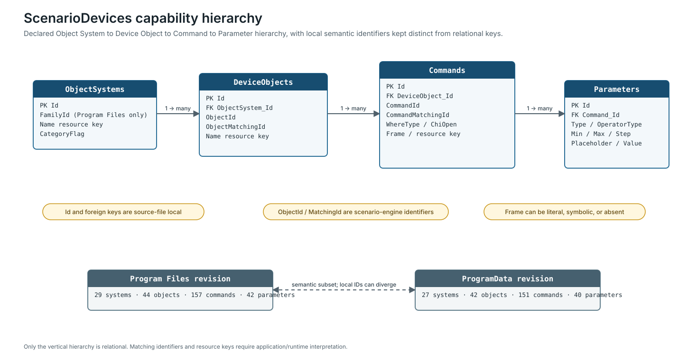

# Scenario Capability Loading

The two ScenarioDevices databases are compact capability catalogues for the MyHOME Suite scenario editor. They are not inventories of installed Devices and do not contain the complete graph of a user-authored scenario.

## Two source revisions

| Source | Object Systems | Device Objects | Commands | Parameters | Schema distinction |
| --- | ---: | ---: | ---: | ---: | --- |
| Program Files copy | 29 | 44 | 157 | 42 | includes `ObjectSystems.FamilyId` |
| ProgramData copy | 27 | 42 | 151 | 40 | no `FamilyId` |

The common semantic content of the ProgramData copy is an exact subset of the Program Files copy when compared by the complete hierarchy and non-local fields. Local row IDs diverge after added rows and must not be used as cross-file identities.

The larger revision adds two Virtual Key Card Object Systems, two Device Objects, four Virtual Key Card event Commands, two Temperature Control action Commands, and two Parameters belonging to those actions. This delta does not establish runtime precedence.

## Declared hierarchy

The files declare this hierarchy:

**Object System → Device Object → Command → Parameter**

| Relationship | Declared foreign key |
| --- | --- |
| Device Object to Object System | `DeviceObjects.ObjectSystem_Id → ObjectSystems.Id` |
| Command to Device Object | `Commands.DeviceObject_Id → DeviceObjects.Id` |
| Parameter to Command | `Parameters.Command_Id → Commands.Id` |

Use local row primary keys only inside one source file.

`ObjectId`, `ObjectMatchingId`, `CommandId`, and `CommandMatchingId` are scenario-engine identifiers. They are not catalogue Object numbers or OpenWebNet fields without a separately established correlation.

## Resource-key-driven presentation

Names such as `miniScenarioSuite.automation.action` are localization/resource keys. They carry useful implementation semantics, including functional family and editor role, but they are not final UI strings.

A consumer should retain both the raw key and any resolved display label. Never use a translated label as a database identity.

## Command classes

| Class | Evidence | Safe treatment |
| --- | --- | --- |
| Literal frame | `Frame` parses as OpenWebNet and agrees with `ChiOpen` | validate address and Parameters, render, then reparse |
| Symbolic frame | non-null text that is not a literal frame | require an application-specific mapping |
| Frame-absent | `Frame IS NULL` | retain editor capability; do not invent an incoming frame |

In the larger revision, 57 Commands have literal OpenWebNet-shaped templates, five have symbolic text, and 95 have no stored frame. Most events and conditions are frame-absent; action rows more often contain renderable frames.

This proves that ScenarioDevices alone is not the incoming-event matcher or the full runtime engine.

## Capability resolution

A safe loader selects one source revision explicitly; preserves categories and matching identifiers; loads all Commands and Parameters; classifies literal, symbolic, and frame-absent rows; validates literal `WHO` values against `ChiOpen`; interprets `WHERE` under the functional `WHO`; and returns source-file and row provenance.

Do not apply “first row wins” selection. The same resource key can occur in different category contexts.

## Missing scenario-instance layer

The four tables contain no complete representation of scenario instance identity, nodes and edges, branch or action ordering, persisted trigger bindings, condition state, retry policy, schedules, or active execution state.

Those concerns require another persistence format or application code not present in the canonical corpus.

The detailed schema, distributions, frame rendering, and open questions are documented in [Scenario Engine](../scenario-engine/).
