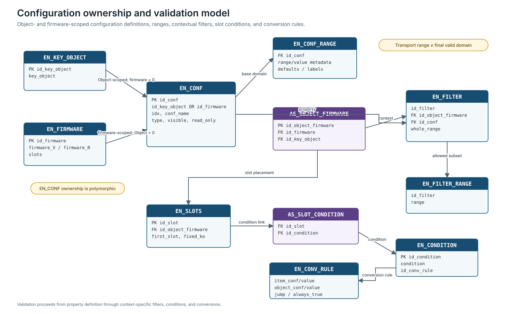

# Validation Layers

MyHOME Suite validation spans several stores. Transport ranges, catalogue domains, contextual filters, conversion rules, and linked-property rules answer different questions and must be applied in order.

## Constraint layers

| Layer | Source | Question answered |
| --- | --- | --- |
| Transport field | `OPEN.db` parameters | Can the encoded value fit the management frame? |
| Property definition | `EN_CONF`, `EN_CONF_RANGE` | What is the property’s base type and domain? |
| Object/firmware context | `EN_FILTER`, `EN_FILTER_RANGE` | Which subset applies to this Object implementation? |
| Slot applicability | `AS_SLOT_CONDITION`, `EN_CONDITION`, `EN_CONV_RULE` | Is this Object/property active, and how is its value converted? |
| Symbol mapping | `CONF_SYMBOL_REF` | Does an explicit item/Object symbol relationship exist in this context? |
| Linked properties | `rules.db3` | Do other properties enable, disable, or constrain this one? |
| Functional semantics | public protocol and observed behavior | Does the encoded value mean the intended operation? |
| Effective state | diagnostic read-back | Did the Device apply the intended configuration? |

The effective domain is the intersection of all applicable layers. A broad `OPEN.db` transport range never overrides a narrower catalogue rule.

The diagram separates polymorphic property ownership from the contextual filters, slot conditions, and conversions that narrow or transform the base domain.

## Context first

Validation begins only after resolving the Physical Device, firmware, internal slot, current Object or Virgin Object, target Object, and applicable Object/firmware association.

Without that context, a configuration `idx`, stored integer, or display label is insufficient.

## Base and contextual domains

`EN_CONF_RANGE` can define named values, numeric bounds, step size, digit width, ordering, and defaults. A missing range row does not imply an unrestricted value.

`EN_FILTER` binds a configuration definition to an `AS_OBJECT_FIRMWARE` context. Related `EN_FILTER_RANGE` rows narrow the base domain for that exact Object/firmware association.

A safe evaluator retains `id_conf` and ownership scope, the raw candidate, base domain, selected filters, condition and conversion path, final encoded value, and unresolved dependencies.

## Conditions and conversions

Slot conditions can depend on other item-level or Object-level symbols. `EN_CONDITION` points into conversion-rule logic represented by `EN_CONV_RULE`.

Do not evaluate a rule with a partial candidate configuration. Missing inputs, ambiguous branches, or unmapped output make the result unresolved.

After conversion, validate the output again against the effective domain and frame transport field. Conversion does not make an excluded value valid.

## `rules.db3` boundary

The canonical `rules.db3` contains additional linked-property rules for selected Temperature Control Objects. References such as `$1`, `$2`, or `$21` are configuration indexes only inside the resolved Object context.

The database is not a global Object registry, a mapping from every `WHO` to configuration, or a substitute for `MHCatalogue.db`.

A controlling-property change can disable another field through `DisablelinkedParameter` behavior. Recompute the affected property set rather than validating only the edited value.

## Read and write distinctions

A property can be writable, conditionally writable, fixed, read-only, hidden but semantically active, unsupported, or unresolved. Visibility is not permission.

Programming must validate the complete replacement state when the selected sequence begins with reset-all. Validating only the changed field is unsafe because omitted Modules or properties may not survive the transfer.

## Result model

| Status | Meaning |
| --- | --- |
| valid | directly allowed in the complete resolved context |
| valid after conversion | allowed through an established conversion path |
| conditionally valid | valid while stated dependencies hold |
| fixed/read-only | part of effective state but not arbitrary input |
| invalid | excluded by an applicable constraint |
| ambiguous | several incompatible resolutions remain |
| unresolved | required source context or mapping is absent |

For the full programming algorithm, see [Programming Validation](../programming/validation.md). Practical SQL examples belong in [Practical Guides](../guides/), where they can be shown in an end-to-end task.
