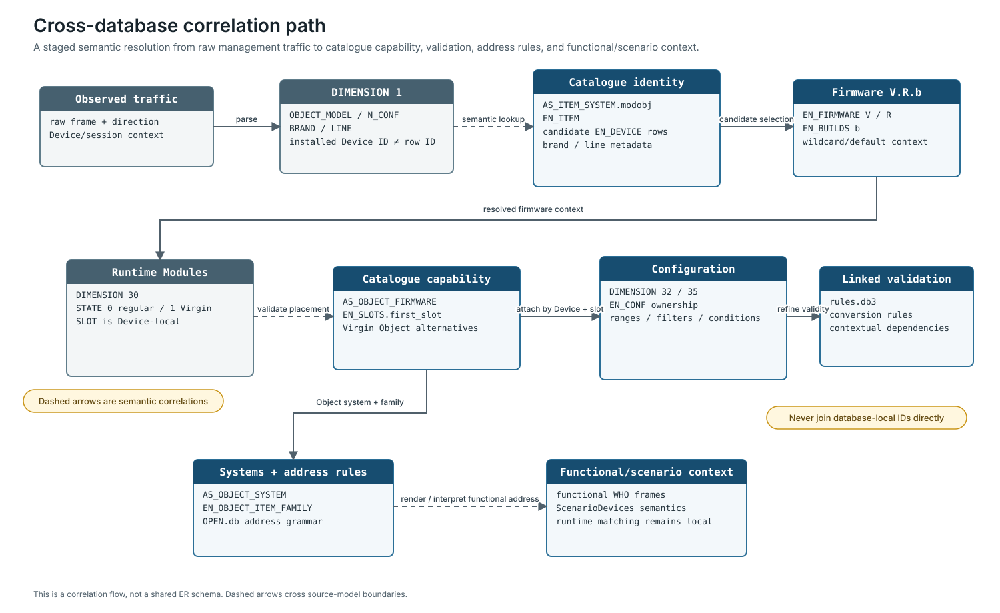

# Cross-Database Correlation

Cross-database analysis connects meanings, not local primary keys. Each MyHOME Suite store represents a different projection of the system, and OpenWebNet traffic represents installed runtime state.

## Source boundaries

| Source | Principal model | Must not be assumed to contain |
| --- | --- | --- |
| `MHCatalogue.db` | products, items, firmware capability, Modules, Objects, configuration and validation | installed Device state or complete functional protocol |
| `OPEN.db` | systems, address grammars, management frames, sequences, timeouts | product catalogue capability or all functional commands |
| `rules.db3` | linked-property rules for selected Objects | global configuration dictionary |
| ScenarioDevices databases | scenario-editor capability hierarchy | installed scenarios or catalogue Object identity |
| `OpenQuery.txt` | named reads over parts of `OPEN.db` | complete application control flow |
| observed traffic | installed state and actual runtime behavior | catalogue labels or unobserved capabilities |

Do not begin with a multi-database join on similarly named integers. Resolve each value in its native namespace first.

## Correlation sequence

Use staged resolution:

1. identify the management family and installed Device selector from traffic;
2. parse `DIMENSION 1` without translating its values prematurely;
3. resolve the catalogue item through model/system meaning;
4. retain all compatible marketed Device/SKU records;
5. resolve the three-component firmware candidate set;
6. build Module/Object state from `DIMENSION 30`;
7. attach addresses and configuration by Device and `slot`;
8. resolve Object systems and family;
9. select candidate `OPEN.db` address rules and functional context;
10. apply catalogue filters, conditions, conversions, and `rules.db3` only in that resolved context;
11. correlate ScenarioDevices behavior through literal frames or semantic paths, never local IDs.

At every stage, preserve both the raw value and the resolved record.



This is a semantic resolution flow, not a shared ER schema. Dashed relationships cross independent source-model namespaces and require the conditions documented below.

## Device identity correlation

`DIMENSION 1` provides four catalogue-facing values:

| Wire field | Catalogue correlation | Confidence |
| --- | --- | --- |
| `OBJECT_MODEL` | `AS_ITEM_SYSTEM.modobj` in the resolved system context | corroborated |
| `N_CONF` | number of physical configurator positions | corroborated for documented Devices |
| `BRAND` | `EN_BRAND.brand_modobj` | corroborated |
| `LINE` | `EN_LINE.line_modobj` | corroborated |

The installed Device ID and `EN_DEVICE.id_device` are different namespaces.

Example: observed model value `107` resolves through `AS_ITEM_SYSTEM.modobj` to shared item `1184`. That item is used by several marketed Devices, including `64391`, `64191`, and `64192`. The correct result is therefore a candidate product set until brand, line, UI/project evidence, or another differentiator selects one record.

Use `EN_DEVICE.name` as the MyHOME Suite-facing Physical Device description. Do not replace it with an Object description from `EN_KEY_OBJECT`.

## Firmware correlation

Diagnostic firmware is a `Version*Release*Build` tuple. Catalogue correlation is distributed across:

```text
EN_FIRMWARE.firmware_V
EN_FIRMWARE.firmware_R
EN_BUILDS.firmware_b
```

Selection must preserve:

- all `EN_FIRMWARE` rows belonging to the resolved item;
- zero, one, or several `EN_BUILDS` rows per firmware definition;
- explicit `-1` components as any/unspecified sentinels;
- absence of a build row as distinct from `firmware_b = -1`;
- `FW_default`, status, localization, slot layout, and capability differences.

The databases establish the candidate model but not MyHOME Suite's exact precedence algorithm. Hardware and microcontroller `V.R.b` responses currently have no direct catalogue fields.

## Runtime Module and Object correlation

`DIMENSION 30` is discriminator-dependent:

```text
STATE = 1 → KEYO is EN_KEY_OBJECT.key_object
STATE = 0 → KEYO is EN_VIRGIN_OBJECT.virgin_key_object
```

`SLOT` is the Device-local internal position. It correlates with placement through `EN_SLOTS.first_slot` after firmware resolution; it is not `EN_SLOTS.id_slot`.

The safe lookup order is:

1. resolve firmware;
2. select the reported `slot`;
3. choose configured Object or Virgin Object namespace from `STATE`;
4. verify that the firmware permits that Object/template at that slot;
5. retain mismatches as evidence rather than forcing the nearest candidate.

This order prevents a globally valid Object number from being accepted in a firmware/slot where it is unavailable.

## Configuration correlation

`DIMENSION 35.INDEX` cannot be joined globally to `EN_CONF.idx`. The effective lookup context is:

```text
Physical Device
+ firmware
+ `slot`
+ configured Object
+ Object-scoped or firmware-scoped ownership
+ INDEX
```

`EN_CONF` contains two exclusive ownership patterns:

| Scope | Required pattern |
| --- | --- |
| Object-scoped | resolved `id_key_object`; `id_firmware = 0` |
| Firmware-scoped | `id_key_object = 0`; resolved `id_firmware` |

After resolving the property definition, validation proceeds through base ranges, Object/firmware filters, filtered ranges, conditions, conversion rules, and linked-property rules. A transport-valid number can still be invalid in that context.

## Object-family address-rule relationship

All 11 nonzero `OPEN.db.EN_ADDRESS_RULE.object_device_family` values resolve to `MHCatalogue.db.EN_OBJECT_ITEM_FAMILY.id_family`. Rule descriptions, family names, and Object membership agree.

```text
EN_ADDRESS_RULE.object_device_family
    0     → family-unqualified rule
    nonzero → EN_OBJECT_ITEM_FAMILY.id_family
                  ← EN_KEY_OBJECT.id_family
```

This relationship narrows the address rules applicable to a resolved Object. It does not by itself select the active system, configuration mode, or final encoder.

The cross-model check can be reproduced by attaching the databases in a derived analysis connection:

```sql
SELECT ar.id_address_rule,
       ar.object_device_family,
       f.family_name
FROM open_db.EN_ADDRESS_RULE AS ar
LEFT JOIN catalogue.EN_OBJECT_ITEM_FAMILY AS f
  ON f.id_family = ar.object_device_family
WHERE ar.object_device_family <> 0
  AND f.id_family IS NULL;
```

The expected result for the canonical pair is empty.

## Candidate mapping for `DIMENSION 32.SYS`

The leading candidate is `MHCatalogue.db.EN_SYSTEM.sys_modobj`.

| Candidate | Assessment |
| --- | --- |
| catalogue `id_system` | local primary key; partial numeric coincidence only |
| `OPEN.db.id_system` | local workflow-registry key |
| functional `WHO` | functional namespace, but predictions differ outside Lighting/Automation |
| diagnostic `WHO` | management family number, incompatible role |
| catalogue `xml_key_system` | useful semantic identifier but textual |
| catalogue `sys_modobj` | numeric external/model field associated with Object systems; strongest candidate |

`sys_modobj` ranges from `0` through `21` in this revision. Multiple system variants can share a value, and one reusable Object can belong to several systems. A reported `SYS` may therefore select an active system context rather than identify one database row.

The mapping remains strongly inferred until a non-Lighting capture distinguishes the candidates. See [Hypothesis Testing](hypothesis-testing.md#dimension-32sys).

## `rules.db3` correlation

`rules.db3` uses external Object numbers and textual configuration references:

- `rules.KOBJECTS` corresponds to `EN_KEY_OBJECT.key_object` for Objects `95`, `96`, and `184` represented in this revision;
- `$N` references correspond to `EN_CONF.idx = N` only after the Object context has been selected;
- negative or decorated references must be parsed according to rule syntax rather than cast blindly to integers.

This database refines linked-property validation for selected Objects. It is not a global index-to-property registry.

## ScenarioDevices correlation

ScenarioDevices supplies exact functional frames for selected commands and semantic resource keys for other capabilities. Its `ObjectId`, `ObjectMatchingId`, `CommandId`, and `CommandMatchingId` remain local to that model.

Safe cross-model evidence includes:

- a literal frame parsed into functional `WHO`, `WHAT`, `WHERE`, and values;
- agreement between `ChiOpen` and the literal frame's `WHO`;
- a resource-key meaning corroborated by frame and editor category;
- full semantic-path comparison between the two ScenarioDevices revisions.

Do not equate ScenarioDevices `ObjectId` with `EN_KEY_OBJECT.key_object` or `FamilyId` with functional `WHO`.

## Avoid circular resolution

An unsafe correlation looks like this:

1. guess an Object from `KEYO` without applying `STATE`;
2. select a firmware row that supports that Object;
3. cite the selected firmware as proof of the Object mapping.

The correct process uses an independently resolved item/firmware, the frame discriminator, and slot placement. If those sources disagree, preserve the disagreement.

## Result representation

A durable cross-database result should retain:

```text
raw wire value and frame
→ parsed wire namespace
→ source database and revision
→ internal row key
→ external catalogue identifier
→ semantic label
→ parent context and discriminator
→ cardinality and candidate set
→ confidence and falsifier
```

Collapsing these layers into one integer makes later validation, debugging, and revision comparison unreliable.
